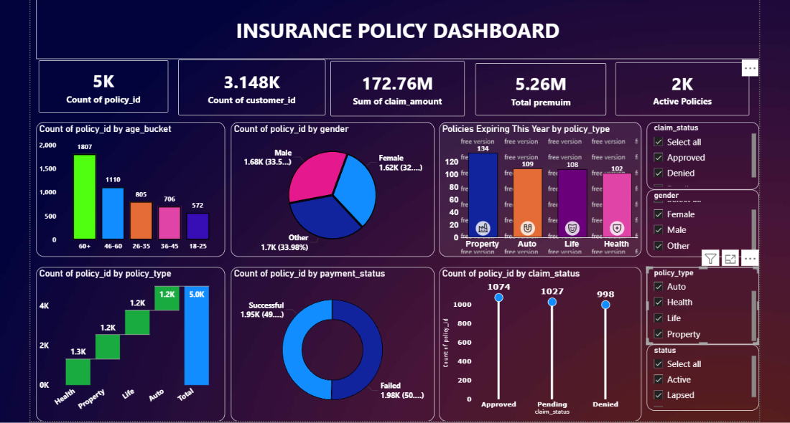

# Insurance Analytics Dashboard – Power BI

## 📊 Project Overview

This project analyzes insurance data using Microsoft Power BI to generate
business insights related to customers, policies, premiums, claims,
payments, and policy expirations.

The dashboard provides an interactive view of insurance performance
across customer demographics, policy types, premium trends, claims,
payments, and policy expiration.

## 🛠️ Tools & Technologies

- Microsoft Power BI
- Power Query
- DAX
- Data Modeling
- Data Visualization

## 🎯 Project Objectives

- Analyze insurance policy distribution.
- Understand customer demographics.
- Track premium trends by policy start year.
- Analyze claims by status.
- Analyze payment status.
- Identify policies expiring in 2026.
- Generate actionable business insights.

## 📈 Key Analysis

### Customer Analysis

- Total Policies: **5,000**
- Total Customers: **3,148**
- Highest policy segment: **60+ age group – 1,807 policies**

### Policy Analysis

- Health: **1,316 policies**
- Property: **1,236 policies**
- Life: **1,234 policies**
- Auto: **1,214 policies**

### Policies Expiring in 2026

- Property: **134**
- Auto: **109**
- Life: **108**
- Health: **102**

### Premium Analysis

Premium was analyzed by policy start year from **2014 to 2024**.

The highest annual premium was recorded in **2022 at ₹5,62,429.24**.

### Claims Analysis

- Approved: **1,074**
- Pending: **1,027**
- Failed: **998**
- Total Claim Amount: **₹251,378,846**

### Payment Analysis

- Successful: **1,952**
- Failed: **1,978**

## 🔍 Key Insights

- The **60+ age group** had the highest policy count with **1,807 policies**.
- **Health** was the most common policy type with **1,316 policies**.
- **Property** had the highest number of policies expiring in 2026 with **134 policies**.
- The highest annual premium was recorded in **2022**.
- Failed payments were slightly higher than successful payments.
- The total claim amount analyzed was **₹251.38 million**.

## 📊 Dashboard Preview

## 📁 Project Files

- `Insurance_Analytics_Dashboard.pbix` – Power BI dashboard containing the complete analysis.
- `dashboard.png` – Dashboard preview image.

## 🎯 Skills Demonstrated

- Power BI
- DAX
- Power Query
- Data Modeling
- Data Cleaning
- Data Transformation
- Data Visualization
- KPI Development
- Exploratory Data Analysis
- Business Insight Generation

## 👤 Author

**Sanjay Balan**
